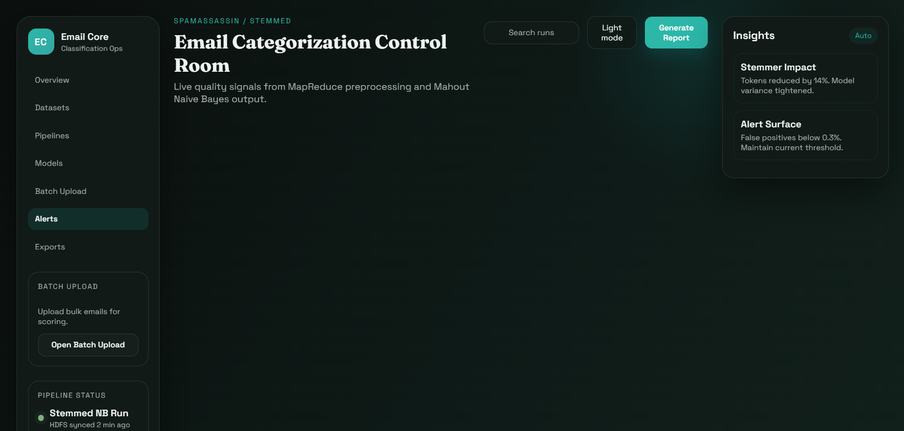

# Email Categorization Using Hadoop + Mahout

This project preprocesses labeled email data with Hadoop MapReduce and trains a Naive Bayes classifier in Mahout. The preprocessing job tokenizes emails and writes cleaned text back to HDFS, preserving labels via the directory structure.

## Requirements

- Java 17
- Ubuntu Linux (native or WSL2 on Windows)
- Node.js 18+ and npm (for the dashboard)
- Hadoop (HDFS and YARN running)
- Mahout CLI on PATH (`mahout`)
- Maven (`mvn`) for building the MapReduce job

## Repo-contained tools (recommended for GitHub)

To avoid relying on system-wide installs, download Hadoop and Mahout into `tools/`:

```
chmod +x scripts/setup_tools.sh
scripts/setup_tools.sh
```

All scripts and the API will automatically use `tools/` if it exists.

## Data layout

Place labeled emails under `data/raw` using one folder per category.

```
data/raw/
  spam/
  important/
```

Each file should contain one email. A small synthetic sample is included to verify the pipeline end-to-end.

## Quick start

```
chmod +x scripts/*.sh
scripts/01_put_raw_to_hdfs.sh
scripts/02_build_preprocess.sh
scripts/03_run_preprocess.sh
scripts/04_run_mahout_nb.sh
```

Or run everything at once:

```
chmod +x scripts/*.sh
scripts/run_all.sh
```

## Dashboard and API

Install dependencies once:

```
cd dashboard
npm install
```

Run the API (port 8787 by default):

```
npm run server
```

Run the dashboard (Vite dev server, port 5173 by default):

```
npm run dev
```

### API configuration

Optional environment variables:

- `PORT` (default 8787)
- `FAST_MODE` (set to `0` to force HDFS model fetch)
- `FEEDBACK_STORE` (default `local+hdfs`)
- `FEEDBACK_LOCAL_PATH` (default `data/feedback/feedback_labels.csv`)
- `FEEDBACK_HDFS_PATH` (default `/email_project/feedback/feedback_labels.csv`)

## Screenshots

<table>
  <tr>
    <td></td>
    <td></td>
  </tr>
  <tr>
    <td></td>
    <td></td>
  </tr>
  <tr>
    <td></td>
    <td></td>
  </tr>
</table>

## Model artifacts for fast inference

Export the trained model into `artifacts/` so the API can run without HDFS:

```
chmod +x scripts/export_model.sh
scripts/export_model.sh
```

The API prefers `artifacts/` when present.

## Notes

- The Hadoop dependency version is set to `3.5.0` in `mapreduce/pom.xml`.
- Outputs are stored under `/email_project` in HDFS.
- `scripts/04_run_mahout_nb.sh` trains and tests on `tf-vectors` for a small demo dataset. For larger datasets, add a train/test split and point `trainnb`/`testnb` at those outputs.
- `mahout testnb` prints a confusion matrix and accuracy summary.
